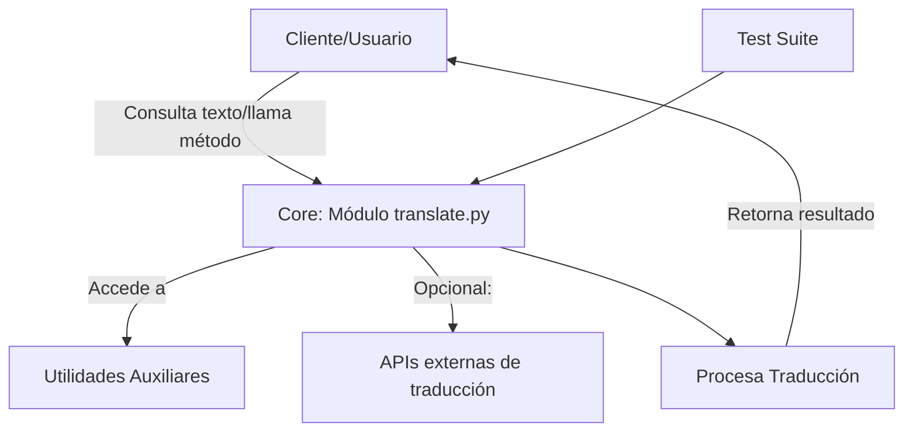

# Arquitectura del Proyecto

Este archivo describe la arquitectura y estructura del proyecto para facilitar la comprensión de los desarrolladores y contribuir de manera efectiva.

## Propósito

El propósito de este proyecto es proporcionar una librería eficiente para realizar traducciones de texto. La arquitectura está diseñada para ser modular, extensible y fácil de mantener. Este archivo detalla cómo están organizados los distintos componentes del proyecto.

## Organización Técnica

La organización del proyecto sigue un diseño estructurado que permite modularidad, pruebas simples y escalabilidad futura. A continuación, se detallan las principales carpetas y archivos que componen el proyecto:

### **Raíz del Proyecto**

La raíz del proyecto contiene los siguientes elementos clave:

- **Scripts y configuraciones generales:**  
  Contiene archivos como `setup.py`, `requirements.txt` y otros relacionados con la configuración e instalación del proyecto.

- **Documentación:**  
  Incluye todos los archivos relacionados con la documentación (`README.md`, `INSTALL_DEV.md`, `CONTRIBUTING.md`, etc.)

- **Herramientas de desarrollo:**  
  Contiene configuraciones como herramientas de linters (por ejemplo, `pylint`, `flake8`) y pre-commits si se utilizan.

### **Carpeta `core`**

Este es el módulo principal que contiene la lógica central de la librería. Los principales puntos de interés aquí son:

- **`translate.py`:**  
  Contiene la lógica principal para realizar traducciones de texto en diferentes idiomas. Este archivo es el núcleo de la funcionalidad del proyecto.

- **Utilidades generales:**  
  Contiene funciones de soporte o herramientas auxiliares que se usan en varias partes del proyecto.

### **Carpeta `tests`**

Incluye todos los casos de prueba del proyecto. Siguiendo un diseño basado en pruebas para garantizar la calidad del código:

- **Estructura de Pruebas:**  
  Cada módulo del proyecto principal tiene un archivo o carpeta correspondiente para sus pruebas, por ejemplo:
    - `test_translate.py`: Contiene pruebas unitarias y de integración para el módulo `translate.py`.

### **Carpeta `docs`**

Incluye toda la documentación adicional del proyecto. Esto puede abarcar guías avanzadas, ejemplos, o material técnico más detallado.

---

## Diagrama de Arquitectura

A continuación, presentamos una visualización simplificada de la arquitectura del proyecto:

### Descripción del Diagrama

1. **Cliente/Usuario:**  
   El punto inicial de interacción, desde donde se llama al método de traducción.

2. **Core (translate.py):**  
   Este es el módulo central que procesará las solicitudes, usará utilidades auxiliares cuando sea necesario y, opcionalmente, llamará a APIs externas para mejorar la traducción.

3. **Utilidades Auxiliares:**  
   Funciones de soporte que ofrecen ayuda para gestionar textos, formatos, validaciones, etc.

4. **APIs Exteriores (Opcionales):**  
   Módulos conectados a servicios externos para traducciones más avanzadas.

5. **Procesamiento Interno:**  
   La lógica del núcleo toma los datos de entrada, los procesa y devuelve un resultado al cliente.

6. **Pruebas (Test Suite):**
   Un flujo paralelo donde cualquier interacción con el módulo core es validada a través del conjunto de pruebas.

---

## Flujo de Trabajo

El flujo principal del proyecto implica las siguientes fases:

1. **Configuración del Entorno**  
   Los desarrolladores configuran el entorno local a través de las instrucciones definidas en el archivo `INSTALL_DEV.md`.

2. **Uso del Core**  
   La funcionalidad central del proyecto se encuentra en la carpeta `core`, donde los usuarios pueden integrar fácilmente el módulo `translate`.

3. **Construcción e Instalación**  
   La instalación y sus dependencias están gestionadas por los archivos de configuración en la raíz del proyecto.

---

## Extensiones Futuras

La arquitectura actual está diseñada para ser extensible agregando nuevos módulos o funcionalidades:

- **Idiomas adicionales:**  
  Se pueden agregar nuevos idiomas o modelos de traducción en `translate.py`.

- **Plugins de terceros:**  
  Gracias a la modularidad, las APIs de traducción de terceros podrían integrarse como extensiones.

- **Soporte para nuevas características:**  
  El proyecto está diseñado con pruebas y documentación que facilitan la implementación de nuevas funcionalidades.

## Organización Modular

Cada componente del proyecto está diseñado para cumplir con una responsabilidad específica de la manera más independiente posible. Esto permite:

1. **Facilidad de pruebas:**  
   Cada componente tiene sus propias pruebas unitarias.

2. **Separación de responsabilidades:**  
   La lógica principal, las pruebas y la documentación no están mezcladas, lo que facilita su mantenimiento.

---

Este archivo será actualizado a medida que la arquitectura del proyecto evolucione y se añadan nuevas características.